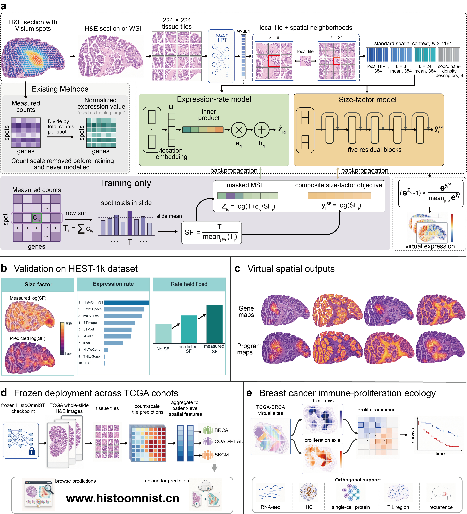

# HistoOmniST

[](https://github.com/StickTaTa/HistoOmniST/actions/workflows/ci.yml)
[](https://github.com/StickTaTa/HistoOmniST/releases/latest)
[](environment.yml)
[](LICENSE)

**HistoOmniST predicts spatial gene expression directly from H&E histology and
reconstructs count-scale virtual spatial transcriptomes.** It predicts
expression rate and a mean-one, slide-normalized size factor (SF) separately,
then recombines them at each spot or tissue tile.

```text
predicted count[i, g] = predicted rate[i, g] x predicted SF[i]
mean(predicted SF within each slide) = 1
```



## At a glance

| Component | Public release |
| --- | --- |
| Input | H&E whole-slide image, tiled TIFF or ordinary RGB image |
| Image representation | HIPT ViT-256 features with spatial context |
| Model outputs | `log1p(rate)` and `log(SF)` |
| Reconstruction | `log1p(max(expm1(rate_log1p), 0) x mean-one SF)` |
| Default inference panel | 28 prespecified genes and eight molecular programs |
| Expression checkpoint | 16,942 coverage-95 canonical genes |
| Training resource | HEST-1k human Visium sections |
| Evaluation boundary | Fixed slide-level partitions, never random spot-level headline splits |
| Deployment | Single images or cohorts supplied through an input list |

The default 28-gene panel matches the public TCGA atlas and keeps routine
inference compact. It does **not** mean that the expression checkpoint contains
only 28 genes. Other genes can be requested with `--selected-genes` when they
are present in the 16,942-gene checkpoint.

HistoOmniST outputs are model-derived virtual spatial signals. They are not
measured spatial transcriptomes, diagnostic annotations or a substitute for
experimental spatial profiling when tissue and resources are available.

## Documentation

| Topic | Guide |
| --- | --- |
| Environment and HIPT setup | [Installation](docs/installation.md) |
| Whole-slide and cohort inference | [Inference](docs/inference.md) |
| HEST-1k preparation and model training | [Training](docs/training.md) |
| Ten-method evaluation | [Benchmark workflow](docs/benchmark.md) |
| Frozen model files | [Release v0.1.0](https://github.com/StickTaTa/HistoOmniST/releases/tag/v0.1.0) |

## Quick start

### 1. Install HistoOmniST

```bash
git clone https://github.com/StickTaTa/HistoOmniST.git
cd HistoOmniST
conda env create -f environment.yml
conda activate histoomnist
```

The publication workflow was exercised with Python 3.10, PyTorch 2.7.0,
CUDA 11.8, NumPy 1.26 and pandas 2.3. CPU inference is supported but is slow
for large whole-slide images.

### 2. Download the frozen models

```bash
python scripts/download_release_models.py
```

The downloader retrieves both assets from GitHub Release `v0.1.0`, places them
at the paths expected by the public workflows and verifies file size and
SHA-256 against [`models/release_manifest.json`](models/release_manifest.json).

| Model | Size | Output |
| --- | ---: | --- |
| Expression-rate checkpoint | 21.79 MiB | `log1p(rate)` for 16,942 genes |
| Size-factor checkpoint | 48.52 MiB | Raw `log(SF)`, normalized to mean one per slide |

### 3. Install the HIPT feature extractor

HistoOmniST uses the ViT-256 encoder from the original
[`mahmoodlab/HIPT`](https://github.com/mahmoodlab/HIPT) project. HIPT is the
image-feature dependency; iStar is a separate method included only in the
external benchmark. The HIPT source and checkpoint remain under their upstream
terms and are not redistributed in this repository.

```bash
python scripts/download_hipt_assets.py
```

The downloader fetches the exact required source file and ViT-256 weight from
the pinned HIPT revision, then verifies both against
[`models/release_manifest.json`](models/release_manifest.json). See
[Installation](docs/installation.md) for paths and checksums.

### 4. Run the real breast cancer tutorial

```bash
jupyter lab notebooks/00_quickstart_inference.ipynb
```

The notebook downloads the public 10x Genomics Xenium FFPE Human Breast Cancer
Rep1 H&E image corresponding to the breast cancer Xenium section discussed in
the manuscript and executes every inference stage as Python code. It displays
the tissue mask and tile grid, extracts and caches HIPT features, predicts both
branches, reconstructs `rate x SF`, and saves tile-level predictions and spatial
maps. The 1.43 GB image is downloaded to the ignored
`data/examples/breast_xenium/` directory and is never committed.

### 5. Predict another virtual spatial transcriptome

```bash
python scripts/histoomnist_predict_uploaded_wsi.py \
  --input /path/to/slide.svs \
  --out-dir outputs/example \
  --write-report \
  --write-zip
```

The command accepts OpenSlide-compatible whole-slide formats, tiled TIFF files
through tifffile/zarr and ordinary RGB images through Pillow. For cohort
inference, repeat `--input` or provide a text/CSV manifest:

```bash
python scripts/histoomnist_predict_uploaded_wsi.py \
  --input-list cohort_slides.csv \
  --out-dir outputs/cohort \
  --skip-figures
```

An input-list CSV must contain one of `path`, `input_path`, `wsi_path` or
`local_path`. See [Inference](docs/inference.md) for tiling controls and the
complete cohort schema.

## Understanding the outputs

Each run writes per-slide tile predictions, a combined `tile_predictions.csv`,
`slide_features.csv`, thumbnails, optional spatial maps and `run_summary.json`.

| Column | Meaning |
| --- | --- |
| `rate_log1p_GENE` | Frozen expression branch output, `log1p(rate)` |
| `pred_log_sf` | Log of predicted SF after mean-one slide normalization |
| `pred_sf` | Predicted SF normalized to mean one within the slide |
| `count_GENE` | Reconstructed count, `max(expm1(rate_log1p_GENE), 0) x pred_sf` |
| `count_log1p_GENE` | Canonical count-scale gene value used downstream |
| `gene_GENE` | Website-compatible alias of `count_log1p_GENE` |
| `program_NAME` | Mean of available count-log1p genes in a prespecified program |

The eight default programs are epithelial, T cell, myeloid, stromal,
proliferation, hypoxia, EMT/TGF-beta and Wnt/CRC. Their exact member genes are
defined in
[`configs/manuscript_release_28_gene_panel.json`](configs/manuscript_release_28_gene_panel.json).

## Train the rate and SF models

HEST-1k raw and processed data are not stored in Git. After obtaining the
public HEST assets, the reproducible high-level workflow is:

```bash
python scripts/hest_audit_metadata.py
python scripts/hest_download_assets.py
python scripts/hest_convert_raw_to_processed_arrays.py
python scripts/hest_extract_patch_features.py
python scripts/hest_build_manifest.py \
  --config configs/hest1k_human_visium_sf_context_distribution_light.yaml
python scripts/hest_make_splits.py --write-split-manifest

python scripts/train_expression.py \
  --config configs/hest1k_human_visium_expression_highconf_symbol95.yaml \
  --device cuda

python scripts/train_sf.py \
  --config configs/hest1k_human_visium_sf_context_distribution_light.yaml \
  --device cuda
```

The committed SF definition is:

```text
SF[i] = total_count[i] / mean(total_count of valid spots in the same slide)
target[i] = log(SF[i])
rate[i, g] = count[i, g] / SF[i]
```

Do not replace this with median normalization. The mean-one definition is part
of the rate-SF decomposition used for count-scale reconstruction. Detailed
input layouts and evaluation commands are in [Training](docs/training.md).

## Evaluate count-scale reconstruction

```bash
python scripts/evaluate_combined.py \
  --sf-config configs/hest1k_human_visium_sf_context_distribution_light.yaml \
  --expression-config configs/hest1k_human_visium_expression_highconf_symbol95.yaml \
  --sf-checkpoint checkpoints/hest1k_human_visium_sf/context_distribution_light_hipt256_leave_slide_out/best.pt \
  --expression-checkpoint checkpoints/hest1k_human_visium_expression/highconf_symbol95_rate/best.pt \
  --splits test
```

This evaluation keeps the rate prediction fixed and compares rate alone,
predicted-SF reconstruction and oracle measured-SF reconstruction.

## Reproduce the ten-method benchmark

The common benchmark covers HistoOmniST, HiST, Hist2ST, HisToGene, iStar,
mclSTExp, Path2Space, sCellST, STimage, ST-Net and THItoGene. This repository
contains project-owned adapters, fixed HEST slide splits, provenance records and
the common evaluator. Complete third-party repositories and their checkpoints
must be obtained from the original authors.

```bash
python scripts/hest_evaluate_benchmark_predictions.py --help
python scripts/hest_eval_histoomnist_benchmark.py --help
```

See [Benchmark workflow](docs/benchmark.md) and
[`THIRD_PARTY_NOTICES.md`](THIRD_PARTY_NOTICES.md). Reduced-gene and smoke runs
must not be reported as formal benchmark results.

## Tutorials

| Notebook | Purpose |
| --- | --- |
| [`00_quickstart_inference.ipynb`](notebooks/00_quickstart_inference.ipynb) | Run the public 10x breast cancer H&E example end to end |
| [`01_hest_data_preparation.ipynb`](notebooks/01_hest_data_preparation.ipynb) | Inspect HEST metadata, arrays, SF and fixed slide splits |
| [`02_train_rate_and_sf.ipynb`](notebooks/02_train_rate_and_sf.ipynb) | Inspect and train both branches through Python APIs |
| [`03_count_scale_evaluation.ipynb`](notebooks/03_count_scale_evaluation.ipynb) | Verify `rate x SF` and run the held-out HEST evaluation API |
| [`04_benchmark_workflow.ipynb`](notebooks/04_benchmark_workflow.ipynb) | Validate and evaluate standardized external prediction bundles |

The notebooks expose intermediate arrays and call project Python APIs directly;
they are not wrappers around shell commands. Long-running full training and
benchmark cells are guarded explicitly because they require the excluded HEST
and third-party assets.

## Repository layout

```text
configs/              fixed model, split, gene-panel and plotting definitions
data/HEST-1k/         public metadata, gene lists and slide-level split manifests
docs/                 installation, inference, training and benchmark guides
models/               release manifest and model-download documentation
notebooks/            five public end-to-end tutorials
examples/             manifests and instructions for public example data
scripts/              preparation, training, evaluation and WSI entry points
src/histoomnist/      installable HistoOmniST package
tests/                release-contract and core workflow tests
```

## Data and release boundaries

The Git repository contains code, configurations, fixed metadata/splits,
documentation and tutorials. The two frozen HistoOmniST checkpoints are GitHub
Release assets.

The repository intentionally excludes raw or processed HEST data, TCGA and
external validation data, whole-slide images, full prediction bundles,
third-party repositories, website uploads and manuscript Source Data. Obtain
these resources from their original providers and follow their access and
licensing terms. Generated files belong in the ignored `results/`, `outputs/`
or local data directories.

## Citation

If you use HistoOmniST, cite the software and accompanying manuscript described
in [`CITATION.cff`](CITATION.cff):

> Huang J, Zheng L. HistoOmniST maps count-scale virtual spatial transcriptomes
> from histology to identify breast cancer immune-proliferation ecology. 2026.

## License

HistoOmniST code is released under the [BSD 3-Clause License](LICENSE).
Third-party methods, datasets and model assets remain governed by their original
licenses.
